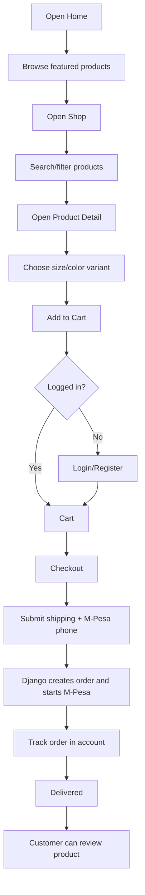

# Nawamu Frontend User Flow

This React storefront is connected to the Django REST API. Django remains the source of truth for products, users, cart, checkout, payments, orders, reviews, support, and admin.

## Primary Shopping Flow



## Implemented React Routes

- `/` - Home with featured products, categories, popular products, and review section.
- `/about` - Brand/backend story and values.
- `/shop` - Product listing with search and filters.
- `/shop/:slug` - Product detail, variant selection, add to cart, favorite, reviews, related products.
- `/contact` - Public contact form that creates a support ticket.
- `/login` and `/register` - JWT auth against Django.
- `/cart` - Anonymous/authenticated cart via backend cart token.
- `/checkout` - Authenticated checkout that starts the M-Pesa backend flow.
- `/favorites` - Authenticated saved products.
- `/support` - Authenticated support ticket list/create flow.
- `/account/orders` - Authenticated order history.
- `/account/orders/:number` - Order detail and status timeline.

## Backend API Mapping

- Products: `/api/products/`, `/api/products/:slug/`
- Search: `/api/products/?q=best+shoes+of+men`
- Categories/brands: `/api/categories/`, `/api/brands/`
- Reviews: `/api/products/:slug/reviews/`
- Favorites: `/api/products/:slug/favorite/`, `/api/favorites/`
- Cart: `/api/cart/current/`, `/api/cart/add_item/`, `/api/cart/update_item/`, `/api/cart/remove_item/`
- Auth: `/api/auth/register/`, `/api/auth/token/`, `/api/auth/me/`
- Checkout: `/api/checkout/`
- Orders: `/api/orders/`, `/api/orders/:number/`
- Support: `/api/support/tickets/`, `/api/support/tickets/:id/reply/`

## Local Run

Start Django:

```bash
.venv/bin/python manage.py runserver
```

Start React:

```bash
cd frontend
npm install
npm run dev
```

Open:

```text
http://127.0.0.1:3000
```
